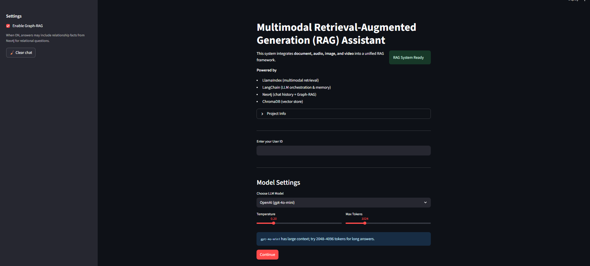

#  Multimodal Retrieval-Augmented Generation (RAG) Assistant

A **Streamlit-based AI assistant** that integrates **text, audio, and image data** into a unified **Retrieval-Augmented Generation** (RAG) framework for **context-aware answers**.The system uses **LangChain**, **Neo4j**, and **multimodal embeddings** with **LLM-based reasoning** to deliver precise and personalized responses.

-**Vector search** across modalities (text, audio transcripts, image embeddings, video transcripts)

-LLM-based reasoning & reranking

-Personalized chat history stored in Neo4j for follow-ups and conversation summaries

---


**Highlights**

-**Multimodal Input Support** – Ask questions via text, upload audio/video (transcribed using Whisper), or provide images (embedded with CLIP).

- **Dynamic Model Selection** → Switch between:
  - `GPT-4o-mini` (OpenAI) — ~128k context tokens
  - `LLaMA3-70B` (Groq) — ~8k context tokens

-**Multimodal Vector Search** – Stores and retrieves embeddings from ChromaDB for text, audio, video, and images.

- **Neo4j Conversation Memory** → Stores and retrieves past chats per user.

-**LLM Reranking** – Combines Reciprocal Rank Fusion (RRF) with LLM-based reranking for more relevant results.

-**Persistent Chat History** – All conversations are stored in Neo4j, enabling long-term memory and context-aware follow-ups.

-**Query Type Detection** – Identifies history queries, follow-ups, and document searches.

- **Fallback to LLM** when retrieval is empty or uncertain.

-**Streamlit Frontend** – Interactive UI with media uploads, chat history viewer, and model configuration.

-**Configurable Parameters** – Choose between OpenAI GPT-4o-mini or Groq LLaMA3-70B with **adjustable temperature & max tokens**.

---


##  Tech Stack

- **Frontend:** Streamlit
- **Backend:** Python, LangChain
- **Database:** ChromaDB (vector store) + Neo4j (session & chat history)
- **Embeddings:**
  - OpenAI Embeddings for text/audio
  - CLIP Embeddings for images
- **LLMs:**
  - OpenAI `gpt-4o-mini`
  - Groq `llama3-70b-8192`

---

##  Project Structure
```

multimodal-rag-assistant/
├── app.py                     # Streamlit frontend
├── vector_search.py           # Retrieval & QA logic
├── config.py                  # Configuration constants
├── requirements.txt           # Python dependencies
├── .env.example               # Environment variables (no secrets)
├── audio_ingestion.py         # Audio ingestion logic
├── video_ingestion.py         # Video ingestion logic
├── document_ingestion.py      # Document ingestion logic
├── image_ingestion.py         # Image ingestion logic
├── screenshots/               # Project screenshots
│   ├── landing_page.png
│   ├── selection.png
│   ├── audio_output.png
│   ├── image_output.png
│   ├── text_output.png
│   └── summary.png
└── README.md                  # Project documentation

```


##  Screenshots

**Landing Page**  


**Selection Page**


**Audio Output**


**Image Output**  


**Text Output**  


**Chat Interface**  


---

##  Installation

### 1️ Clone the Repository
```bash
git clone https://github.com/yourusername/multimodal-rag-assistant.git
cd multimodal-rag-assistant
```
### Create Virtual Environment
```
python -m venv venv
source venv/bin/activate      
venv\Scripts\activate         
```
### Install Dependencies
```
pip install -r requirements.txt

```

### Configure Environment Variables
in the .env file  add your keys:
```
OPENAI_API_KEY=your-openai-key
GROQ_API_KEY=your-groq-key
NEO4J_URI=bolt://localhost:7687
NEO4J_USER=neo4j
NEO4J_PASSWORD=your-password

```

### Run the Application
```
streamlit run app.py
```
### Workflow

User Input: Accepts text, image, Video or Audio queries.

Query Classification: Detects follow-up, history-based, or new queries.

Multimodal Retrieval: Fetches from text, audio, and image embeddings in ChromaDB.

Reranking: Uses LLM to prioritize relevant results.

Answer Generation: RAG pipeline or LLM-only fallback.

History Storage: Saves conversation to Neo4j per user session.


#### License

This project is licensed under the MIT License.
