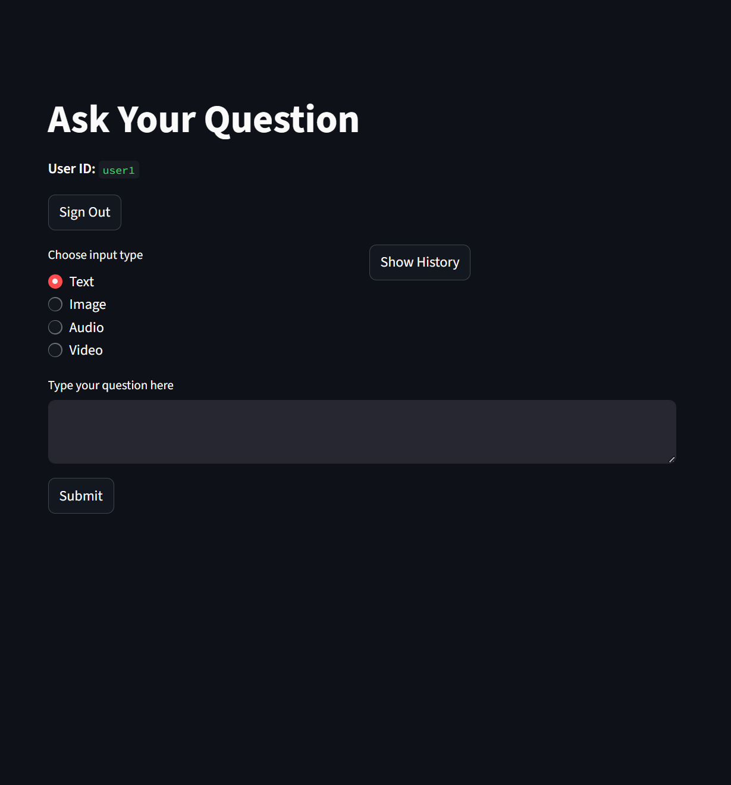
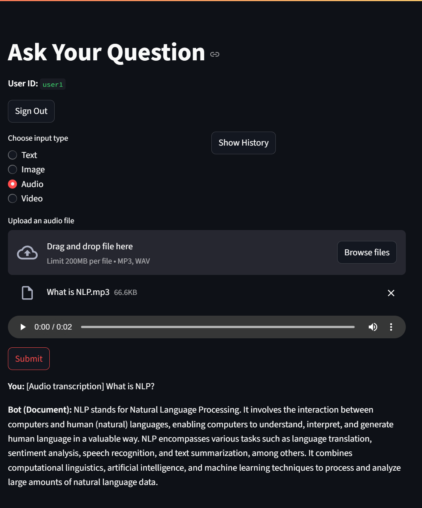
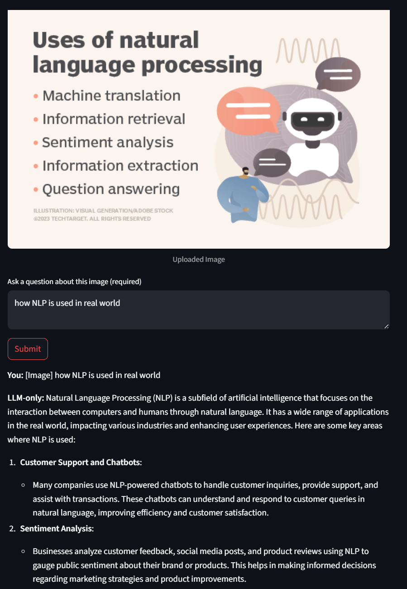
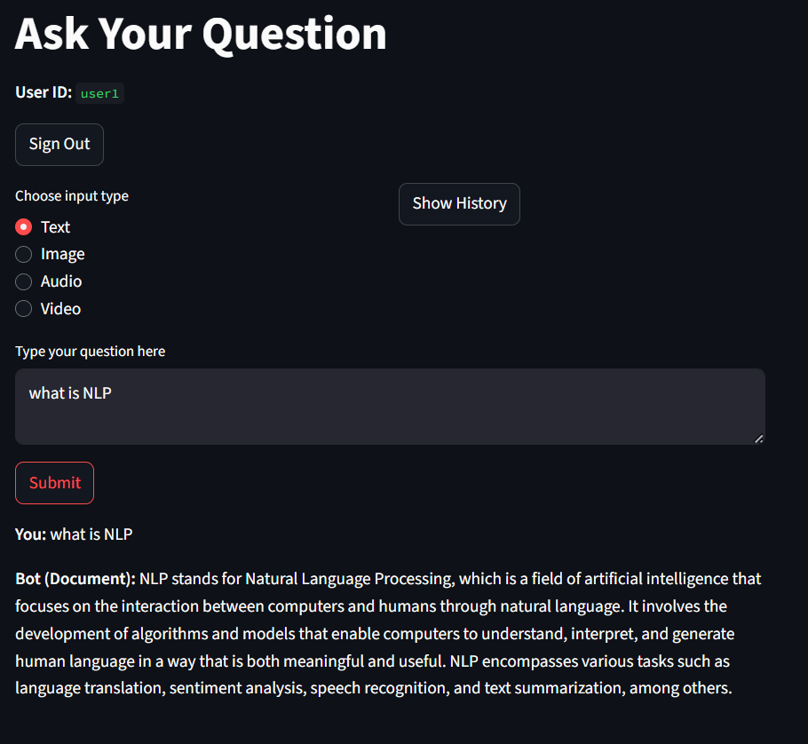
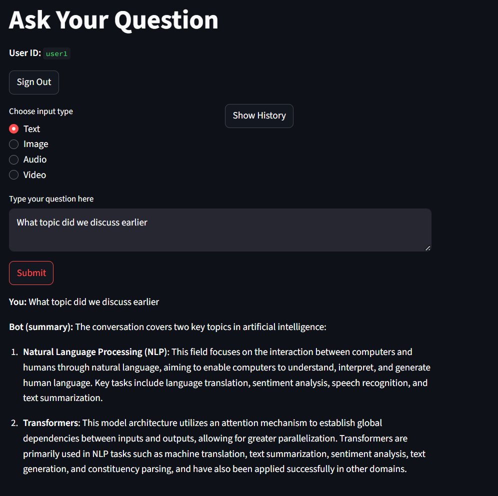

#  Multimodal Retrieval-Augmented Generation (RAG) Assistant

A **Streamlit-based AI assistant** that integrates **text, audio, image, and video data** into a unified **Retrieval-Augmented Generation (RAG)** framework for **context-aware answers**.  
The system combines **LlamaIndex**, **LangChain**, and **Neo4j Graph-RAG** to deliver precise, explainable, and multimodal insights with persistent conversation history.

---

##  Features

- **Multimodal Input Support** – Query using text, upload audio/video (transcribed with Whisper), or images (embedded with CLIP).
- **Hybrid RAG Engine** – Combines LlamaIndex (retrieval) and LangChain (orchestration, memory).
- **Graph-RAG Enrichment** – Enhances answers using relationship facts stored in **Neo4j** (e.g., *“How is OpenAI connected to Microsoft?”*).
- **LLM-Based Reranking** – Uses Reciprocal Rank Fusion (RRF) and reranking for better context relevance.
- **Persistent Chat History** – All sessions are saved to Neo4j for context-aware follow-ups.
- **Dynamic Model Selection**
  - `GPT-4o-mini` (OpenAI) – ~128k context
  - `LLaMA-3.3-70B-Versatile` (Groq) – ~8k context
- **Configurable UI Controls** – Toggle Graph-RAG, choose model, adjust temperature and max tokens.
- **Streamlit Frontend** – Clean, modern interface with media upload, chat history viewer, and user session tracking.

---
##  Tech Stack

| Layer | Technology |
|-------|-------------|
| **Frontend** | Streamlit |
| **Backend** | Python, LangChain, LlamaIndex |
| **Database** | ChromaDB (vector store) + Neo4j (graph & session history) |
| **Embeddings** | OpenAI (text/audio) + CLIP (images) |
| **LLMs** | OpenAI GPT-4o-mini, Groq LLaMA-3.3-70B |
| **Audio/Video** | Whisper (OpenAI) transcription |

---

##  Project Structure
```
multimodal-rag-assistant/
├── app.py # Streamlit frontend (main UI)
├── vector_search.py # Core hybrid RAG & Graph-RAG logic
├── llama_index_setup.py # LlamaIndex configuration & retriever setup
├── config.py # Central configuration & environment settings
├── graph_enrichment.py # Triple extraction and Neo4j enrichment
├── graph_queries.py # Querying relationships from Neo4j
├── document_ingestion.py # Document ingestion (text embedding)
├── image_ingestion.py # Image embedding via CLIP
├── audio_ingestion.py # Audio transcription & embedding
├── video_ingestion.py # Video → audio → text ingestion
├── requirements.txt # Python dependencies
├── .env.example # Environment variable template
├── Screenshots/ # UI screenshots
│ ├── landing_page.png
│ ├── selection.png
│ ├── audio_output.png
│ ├── image_output.png
│ ├── text_output.png
│ └── summary.png
└── README.md
```

---

##  Workflow Overview

1. **User Input**  
   Text, image, audio, or video input provided via Streamlit UI.  

2. **Query Classification**  
   System detects if it’s a history query, follow-up, or new query.  

3. **Ingestion & Indexing**  
   - Text → OpenAI embeddings  
   - Image → CLIP embeddings  
   - Audio/Video → Whisper → text → embeddings  

4. **Multimodal Retrieval (LlamaIndex)**  
   Retrieves top-k results from Chroma vector store across all modalities.

5. **RRF + LLM Reranking (LangChain)**  
   Combines and reranks results for best relevance.

6. **Graph-RAG Enrichment (Neo4j)**  
   Extracts entity-relation triples (E1-REL-E2) and adds relational reasoning.  

7. **Answer Generation**  
   Synthesizes the final grounded answer via LLM.

8. **Session Persistence**  
   Logs Q&A and sources into Neo4j (for contextual follow-ups).

---

##  Screenshots

**Landing Page**  


**Input Selection**  


**Audio Query Output**  


**Image Query Output**  


**Text Query Output**  


**Conversation Summary**  


---
##  Installation Guide

###  Clone the Repository

```
git clone https://github.com/Theepankumargandhi/multimodal-rag-assistant--Llamaindex.git
```
```
cd multimodal-rag-assistant--Llamaindex
```
---
## Install Dependencies
```
pip install -r requirements.txt
```
## Configure Environment Variables
```
OPENAI_API_KEY=your-openai-key
GROQ_API_KEY=your-groq-key
NEO4J_URI=bolt://localhost:7687
NEO4J_USER=neo4j
NEO4J_PASSWORD=your-password
```
---
## Prepare Data
data/docs/        → PDF/TXT documents
data/images/      → JPG/PNG images
data/audio/       → MP3/WAV audio
data/video/       → MP4/MOV videos

## Run the ingestion scripts
```
python document_ingestion.py
python image_ingestion.py
python audio_ingestion.py
python video_ingestion.py
```
## Launch the App
```
streamlit run app.py
```
---
## Graph-RAG Mode

When Graph-RAG is enabled (toggle in sidebar):

Extracts and stores knowledge triples (Entity1 -[REL]-> Entity2) in Neo4j.
Answers are enriched with supporting graph facts for relational queries.

Example:
Q: “How is OpenAI connected to Microsoft?”
A: “OpenAI partnered with Microsoft to deploy models on Azure. (Graph Context: PARTNERS_WITH)”

To inspect your graph manually in Neo4j:
```
MATCH (a:Entity)-[r:REL]->(b:Entity)
RETURN a.name, r.label, r.source_doc, r.chunk_id, b.name
LIMIT 25;
```
